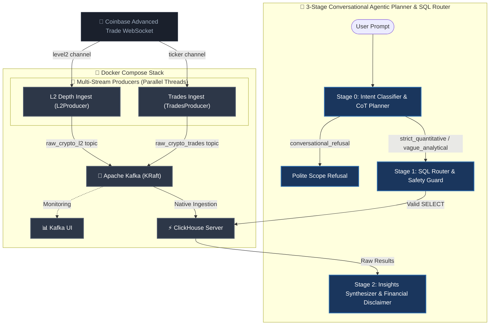

# 🪙 Real-Time Crypto Streaming Pipeline

A production-grade, real-time data streaming pipeline. This architecture ingests high-frequency trade events from Coinbase, buffers them via Apache Kafka, and streams them directly into a ClickHouse OLAP database for sub-second analytical querying and real-time visualization.

---

## 🏗️ System Architecture



---

## ⚡ Core Features

- **Modular Multi-Stream Ingestion**: Implements an elegant Object-Oriented Design (OOD) with a shared base class wrapper (`BaseCoinbaseProducer`) and decoupled, parallel execution threads for real-time Trades and L2 Order Book Depth.
- **High-Fidelity Schema Extraction**: Ingests the modern Coinbase Advanced Trade WebSocket API, capturing all 12+ pricing, spread limits, sequence numbers, and deep L2 bids/offers (flattened and streamed independently).
- **Shock-Absorbing Broker Separation**: Routes trades and L2 depth to **separate Kafka topics** (`raw_crypto_trades` and `raw_crypto_l2`) to decouple analytical loads and optimize performance.
- **Zero-Connector Ingestion**: ClickHouse pulls directly from Kafka using its **Native Kafka Engine** and a **Materialized View**, eliminating heavy middleware.
- **Resilient loops**: Thread-safe buffering queues, high-performance LZ4 network payload compression, progressive startup connection backoffs, and robust loop-based non-recursive reconnection supervisors.
- **Fully Containerized**: The entire data platform boots reliably with a single Docker Compose command.

---

## 🛠️ Technology Stack

| Component | Technology | Description |
| :--- | :--- | :--- |
| **Data Source** | [Coinbase WebSocket](https://docs.cloud.coinbase.com/exchange/docs/websocket-overview) | Real-time public trade ticker feed |
| **Ingestion Engine** | [Python 3.11+](https://www.python.org/) | Thread-buffered client publishing to Kafka |
| **Message Broker** | [Apache Kafka (KRaft)](https://kafka.apache.org/) | Scalable append-only event queueing |
| **Observability** | [Kafka UI](https://github.com/provectuslabs/kafka-ui) | Web UI for broker monitoring and topic inspection |
| **OLAP Database** | [ClickHouse](https://clickhouse.com/) | Columnar database for high-throughput, low-latency analytics |
| **Orchestration** | [Docker Compose](https://www.docker.com/) | Multi-container lifecycle orchestration |

---

## 🚀 Quick Start Guide

### Prerequisites
- [Docker Desktop](https://www.docker.com/products/docker-desktop/) (running)
- Python 3.11+ (optional, for local development)
- **Gemini API Key** (required for the AI Agent; free from [Google AI Studio](https://aistudio.google.com/))

### 1. Boot the Stack
Spin up the containerized pipeline from the root directory. If a pre-existing pipeline is already running, perform a clean volume reset first to ensure database schema updates are correctly initialized:
```bash
# Clean reset (highly recommended if upgrading schemas)
docker compose down -v

# Boot the multi-stream stack
docker compose up -d --build
```
This initializes Kafka (KRaft), Kafka UI (port `8080`), ClickHouse (port `8123` & `9000`), and the Python producer.

### 2. Verify Data Ingestion
Check the concurrent multi-stream logs:
```bash
docker compose logs -f crypto-producer
```
You should see parallel ingestion activities for both the Trades (`Trades`) and L2 Depth (`L2 Depth`) channels:
```text
crypto-producer  | 2026-05-30 14:40:11,532 [INFO] 📡 [Trades] Ingest -> BTC-USD | Price: $73863.55 | 24h Vol: 4150.65 | Ask: 73863.55 (Queue: 0)
crypto-producer  | 2026-05-30 14:40:11,538 [INFO] 📊 [L2 Depth] Ingest -> BTC-USD | OFFER | Price: $73863.55 | Vol: 0.006734 | Type: update (Queue: 0)
crypto-producer  | 2026-05-30 14:40:11,539 [INFO] 📊 [L2 Depth] Ingest -> BTC-USD | BID | Price: $73788.01 | Vol: 0.000000 | Type: update (Queue: 1)
```

### 3. Running Locally (Alternative)
For local development, you can run the orchestrator outside Docker in your active virtual environment:
```bash
KAFKA_BROKER="localhost:9092" python producer/producer.py
```
This boots both streams concurrently in parallel execution threads on your host machine.

### 4. Access Dashboards & Web UI
* **Kafka UI**: Browse topic partitions and messages at `http://localhost:8080`.
* **ClickHouse Playground**: Write queries in the browser console at `http://localhost:8123/play` (User: `default`, Password: `password123`).

---

## 🔍 Database Verification

Verify data flowing into ClickHouse using the **ClickHouse Playground**:

1. Open your browser and navigate to **[http://localhost:8123/play](http://localhost:8123/play)**.
2. Log in using the default credentials:
   - **User:** `default`
   - **Password:** `password123`
3. Copy and run any of the following queries in the editor:

### 1. Ingested Ticks (Last 10 Rows)
```sql
SELECT symbol, price, volume_24h, best_bid, best_ask, server_time 
FROM crypto_ticks_raw 
LIMIT 10;
```

### 2. Real-Time Ticks Aggregation Metrics
```sql
SELECT symbol, count(), round(avg(price), 2) AS avg_price 
FROM crypto_ticks_raw 
GROUP BY symbol;
```

### 3. Flattened L2 Order Book Depth Updates (Last 10 Rows)
```sql
SELECT symbol, side, price, volume, trade_time 
FROM crypto_l2_raw 
LIMIT 10;
```

### 4. Real-Time Best Bid-Ask Spreads (L2 Depth Data)
```sql
SELECT 
    symbol, 
    max(price) FILTER(WHERE side = 'bid') AS best_bid, 
    min(price) FILTER(WHERE side = 'offer') AS best_ask, 
    round(best_ask - best_bid, 4) AS spread 
FROM crypto_l2_raw 
GROUP BY symbol;
```

---

## 🤖 AI Data Analytics Agent (POC)

An interactive, state-of-the-art **3-Stage Conversational Agentic Planner & Intent Router** querying your real-time streaming database on the fly using natural language.

---

### 🔬 3-Stage Pipeline Architecture

Instead of a brittle, single-stage text-to-SQL script, the agent executes a structured **3-stage cognitive pipeline** designed in native Python for maximum speed and control:

```
                  ┌──────────────────────────────┐
                  │      User Question / Prompt  │
                  └──────────────┬───────────────┘
                                 │
                   [Stage 0: CoT Intent & Planner]
                                 │
         ┌───────────────────────┼───────────────────────┐
         ▼                       ▼                       ▼
 ┌──────────────┐        ┌──────────────┐        ┌──────────────┐
 │conversational│        │    strict    │        │    vague     │
 │   refusal    │        │ quantitative │        │  analytical  │
 └──────┬───────┘        └──────┬───────┘        └──────┬───────┘
        │                       │                       │
 [Scope Refusal]                │            [Empirical Plan Formulated]
        │                       └───────────┬───────────┘
        ▼                                   │
 ┌──────────────┐                 [Stage 1: Safety Guard]
 │Bypasses DB,  │                           │
 │Explanatory   │                    [Execute Query]
 │   Refusal    │                           │
 └──────────────┘                           ▼
                                  ┌───────────────────┐
                                  │   ClickHouse DB   │
                                  └─────────┬─────────┘
                                            │
                                            ▼
                                  [Stage 2: Insights Synthesizer]
                                            │
                                            ▼
                               ┌───────────────────────────┐
                               │Grounded Markdown Dashboard│
                               │(with Financial Disclaimer)│
                               └───────────────────────────┘
```

#### 1. Stage 0: Intent Classifier & Planner (CoT)
Evaluates user prompts utilizing **Chain-of-Thought (CoT)** reasoning. Before generating any database code, the model classifies user intent into one of three categories:
*   `conversational_refusal`: The query is unrelated to cryptocurrency or completely out of scope of our database schema.
*   `strict_quantitative`: The query is a direct request for specific database values or aggregates.
*   `vague_analytical`: The query is speculative, qualitative, or causal (e.g. *"Which coin will make me a millionaire the fastest?"*, *"Why did Bitcoin price drop?"*). Evolving the speculative query into a structured, empirical search plan, it plans SQL queries to fetch indicators of momentum, volatility, and volume surges.

#### 2. Stage 1: Safety Guard & Database Execution
*   If `conversational_refusal`, the agent bypasses the database entirely, executing a custom system fallback that explains our exact database coverage boundaries.
*   If `strict_quantitative` or `vague_analytical`, the generated SQL is passed to a strict, comment-stripping read-only safety validator `is_query_safe(sql)`. Forbidden write-keywords (e.g., `DROP`, `DELETE`, `TRUNCATE`) are blocked immediately. Verified queries are executed against ClickHouse with `MAX_ROWS` limits.

#### 3. Stage 2: Insights Synthesizer & Disclaimers
Takes the original question, Stage 0 planner thoughts, executed query, and returned database rows, synthesizing a premium, markdown-formatted dashboard response.
*   **Speculative Prompt Handlers**: For `vague_analytical` prompts, the synthesizer automatically prepends a prominent, **bold italicized financial disclaimer** explaining that it does not offer financial advice, and presents empirical indicators of risk and momentum to help the user evaluate trends objectively.

---

### 🚀 Running the Agent

1. **Install dependencies**:
   ```bash
   pip install -r agent_poc/requirements.txt
   ```

2. **Configure your API Keys**:
   Create a `.env` file in the project root and add your Gemini API Key and/or Hugging Face Access Token:
   ```env
   GEMINI_API_KEY=your_gemini_api_key_here
   HF_TOKEN=your_huggingface_access_token_here
   ```

3. **Execution Modes**:
   *   **Interactive REPL Mode (Recommended)**:
       Launches a premium, conversational shell session where you can ask successive questions:
       ```bash
       python agent_poc/agent.py --provider hf
       ```
   *   **Single Question Query**:
       Run a single query directly from your terminal using the `-q` / `--question` flag:
       ```bash
       python agent_poc/agent.py --provider hf -q "Show me the current drawdown of BTC-USD"
       ```
   *   **Automated Evaluation Suite**:
       Execute our pre-defined verification query suite across all intent categories:
       ```bash
       python agent_poc/agent.py --provider hf --test
       ```

4. **Model Provider Options (`--provider`)**:
   *   `hf` (Default): Uses the remote serverless model `google/gemma-4-26B-A4B-it` routed through Hugging Face's high-reliability serverless completions endpoint `router.huggingface.co/v1/chat/completions`. Requires `HF_TOKEN`. Bypasses local DNS resolution failures and executes instantly.
   *   `gemini`: Uses Google Gemini 3.5 Flash (requires `GEMINI_API_KEY`).
   *   `local`: Runs the public, non-gated model `Qwen/Qwen2.5-1.5B-Instruct` completely locally on your hardware (Apple Silicon MPS, Nvidia CUDA, or CPU) via `transformers` (requires `torch`, `transformers`, `accelerate`). Automatically activates Hugging Face **offline mode** after weight initialization, guaranteeing secure, network-isolated execution.

---

### 💡 Sample Prompts to Try

The agent leverages high-frequency tick records, L2 depth spreads, static token metadata, and stateful pre-aggregated risk views to answer a diverse set of queries:

| Category | Natural Language Prompt | Under the Hood (Agent Pipeline Action) |
| :--- | :--- | :--- |
| **Out-of-Scope Refusal** | `"What is the capital city of France?"` | Classified as `conversational_refusal`. Bypasses database, prints polite dataset boundary explanation. |
| **Speculative Query** | `"Which coin will make me a millionaire the fastest? Explain your reasoning"` | Classified as `vague_analytical`. Generates query on `view_volume_spikes` and `view_risk_and_volatility`, displays a prominent financial disclaimer, and lists momentum leaders. |
| **Causal Analysis** | `"Explain why BTC-USD price drops might justify its status as a relative safe haven compared to altcoins."` | Classified as `vague_analytical`. Joins static `token_metadata` (Proof of Work, Digital Gold) with `view_risk_and_volatility` log returns to ground a causal analysis. |
| **Market Volumetrics** | `"Did the volume for ETH-USD spike over the last hour, or is the market quiet?"` | Classified as `strict_quantitative`. Queries `view_volume_spikes` for recent rolling ratios. |
| **Spread Analysis** | `"Show me the latest best bid, best ask, and spread for SOL-USD computed from the L2 updates."` | Classified as `strict_quantitative`. Filters `crypto_l2_raw` by side and symbol to calculate market spreads. |

---

## 🔬 Architectural Highlights

### 1. In-Memory Queue Buffer
The Python producer isolates the network thread from the Kafka producer to prevent packet drops due to backpressure:
- **WebSocket Thread**: Ingests high-frequency JSON frames and pushes to a thread-safe `queue.Queue`.
- **Worker Daemon**: Dequeues records and writes them to Kafka with **LZ4 compression** (saving up to 70% payload size).
- **Startup Sync**: A 10-attempt exponential backoff guarantees clean Kafka connectivity on cold boots.

### 2. ZooKeeper-less Apache Kafka (KRaft)
Consensus is managed internally using KRaft, yielding sub-second controller election times, a streamlined footprint, and zero extra container overhead.

### 3. Segregated Three-Tier Ingestion Pipelines
To bypass heavy, resource-intensive middleware connectors, ClickHouse directly consumes from Kafka using segregated, modular pipelines:
* **DDL Organization (`clickhouse/` directory)**: Segregates database definitions into independent, clean schemas (`01_ticks_schema.sql` and `02_l2_schema.sql`), auto-executed in order by the ClickHouse init wrapper upon boot.
* **Twin Virtual Queues (`kafka_crypto_ticks` & `kafka_crypto_l2`)**: Active database Kafka-engine consumers subscribing to separate streams (`raw_crypto_trades` and `raw_crypto_l2`).
* **Twin Materialized Views (`mv_crypto_ticks_raw` & `mv_crypto_l2_raw`)**: Background, event-driven pipes parsing ISO-timestamp payloads into high-precision `DateTime64` formats and pushing records directly to disk.
* **Twin Columns Stores (`crypto_ticks_raw` & `crypto_l2_raw`)**: High-performance MergeTree tables sorted by trading indexes (`ORDER BY`) to ensure sub-millisecond query execution.

---

## 🛣️ Roadmap
- [ ] **Real-Time Streamlit Dashboard**: Integrate a frontend to visualize live analytics directly from ClickHouse.
- [X] **AI Assistant**: Introduce a Text-to-SQL chatbot leveraging Gemini to query streaming tables using natural language.
- [ ] **Resilient API Rate-Limit Handling**: Integrate automatic retry-backoff algorithms (e.g., tenacity or standard loop delay guards) into the AI CLI agent to gracefully handle the 5 RPM free tier quota.