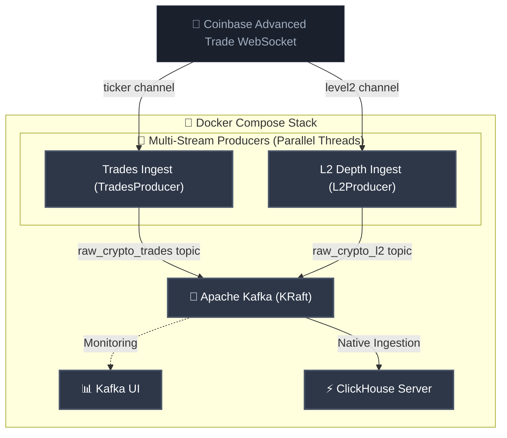

# 🪙 Real-Time Crypto Streaming Pipeline

A production-grade, real-time data streaming pipeline. This architecture ingests high-frequency trade events from Coinbase, buffers them via Apache Kafka, and streams them directly into a ClickHouse OLAP database for sub-second analytical querying and real-time visualization.

---

## 🏗️ System Architecture



---

## ⚡ Core Features

- **Modular Multi-Stream Ingestion**: Implements an elegant Object-Oriented Design (OOD) with a shared base class wrapper (`BaseCoinbaseProducer`) and decoupled, parallel execution threads for real-time Trades and L2 Order Book Depth.
- **High-Fidelity Schema Extraction**: Ingests the modern Coinbase Advanced Trade WebSocket API, capturing all 12+ pricing, spread limits, sequence numbers, and deep L2 bids/offers (flattened and streamed independently).
- **Shock-Absorbing Broker Separation**: Routes trades and L2 depth to **separate Kafka topics** (`raw_crypto_trades` and `raw_crypto_l2`) to decouple analytical loads and optimize performance.
- **Zero-Connector Ingestion**: ClickHouse pulls directly from Kafka using its **Native Kafka Engine** and a **Materialized View**, eliminating heavy middleware.
- **Resilient loops**: Thread-safe buffering queues, high-performance LZ4 network payload compression, progressive startup connection backoffs, and robust loop-based non-recursive reconnection supervisors.
- **Fully Containerized**: The entire data platform boots reliably with a single Docker Compose command.

---

## 🛠️ Technology Stack

| Component | Technology | Description |
| :--- | :--- | :--- |
| **Data Source** | [Coinbase WebSocket](https://docs.cloud.coinbase.com/exchange/docs/websocket-overview) | Real-time public trade ticker feed |
| **Ingestion Engine** | [Python 3.11+](https://www.python.org/) | Thread-buffered client publishing to Kafka |
| **Message Broker** | [Apache Kafka (KRaft)](https://kafka.apache.org/) | Scalable append-only event queueing |
| **Observability** | [Kafka UI](https://github.com/provectuslabs/kafka-ui) | Web UI for broker monitoring and topic inspection |
| **OLAP Database** | [ClickHouse](https://clickhouse.com/) | Columnar database for high-throughput, low-latency analytics |
| **Orchestration** | [Docker Compose](https://www.docker.com/) | Multi-container lifecycle orchestration |

---

## 🚀 Quick Start Guide

### Prerequisites
- [Docker Desktop](https://www.docker.com/products/docker-desktop/) (running)
- Python 3.11+ (optional, for local development)
- `curl` (for testing)
- **Gemini API Key** (required for the AI Agent; free from [Google AI Studio](https://aistudio.google.com/))

### 1. Boot the Stack
Spin up the containerized pipeline from the root directory. If a pre-existing pipeline is already running, perform a clean volume reset first to ensure database schema updates are correctly initialized:
```bash
# Clean reset (highly recommended if upgrading schemas)
docker compose down -v

# Boot the multi-stream stack
docker compose up -d --build
```
This initializes Kafka (KRaft), Kafka UI (port `8080`), ClickHouse (port `8123` & `9000`), and the Python producer.

### 2. Verify Data Ingestion
Check the concurrent multi-stream logs:
```bash
docker compose logs -f crypto-producer
```
You should see parallel ingestion activities for both the Trades (`Trades`) and L2 Depth (`L2 Depth`) channels:
```text
crypto-producer  | 2026-05-30 14:40:11,532 [INFO] 📡 [Trades] Ingest -> BTC-USD | Price: $73863.55 | 24h Vol: 4150.65 | Ask: 73863.55 (Queue: 0)
crypto-producer  | 2026-05-30 14:40:11,538 [INFO] 📊 [L2 Depth] Ingest -> BTC-USD | OFFER | Price: $73863.55 | Vol: 0.006734 | Type: update (Queue: 0)
crypto-producer  | 2026-05-30 14:40:11,539 [INFO] 📊 [L2 Depth] Ingest -> BTC-USD | BID | Price: $73788.01 | Vol: 0.000000 | Type: update (Queue: 1)
```

### 3. Running Locally (Alternative)
For local development, you can run the orchestrator outside Docker in your active virtual environment:
```bash
KAFKA_BROKER="localhost:9092" python producer/producer.py
```
This boots both streams concurrently in parallel execution threads on your host machine.

### 4. Access Dashboards & Web UI
* **Kafka UI**: Browse topic partitions and messages at `http://localhost:8080`.
* **ClickHouse Playground**: Write queries in the browser console at `http://localhost:8123/play` (User: `default`, Password: `password123`).

---

## 🔍 Database Verification

Verify data flowing into ClickHouse using the **ClickHouse Playground**:

1. Open your browser and navigate to **[http://localhost:8123/play](http://localhost:8123/play)**.
2. Log in using the default credentials:
   - **User:** `default`
   - **Password:** `password123`
3. Copy and run any of the following queries in the editor:

### 1. Ingested Ticks (Last 10 Rows)
```sql
SELECT symbol, price, volume_24h, best_bid, best_ask, server_time 
FROM crypto_ticks_raw 
LIMIT 10;
```

### 2. Real-Time Ticks Aggregation Metrics
```sql
SELECT symbol, count(), round(avg(price), 2) AS avg_price 
FROM crypto_ticks_raw 
GROUP BY symbol;
```

### 3. Flattened L2 Order Book Depth Updates (Last 10 Rows)
```sql
SELECT symbol, side, price, volume, trade_time 
FROM crypto_l2_raw 
LIMIT 10;
```

### 4. Real-Time Best Bid-Ask Spreads (L2 Depth Data)
```sql
SELECT 
    symbol, 
    max(price) FILTER(WHERE side = 'bid') AS best_bid, 
    min(price) FILTER(WHERE side = 'offer') AS best_ask, 
    round(best_ask - best_bid, 4) AS spread 
FROM crypto_l2_raw 
GROUP BY symbol;
```

---

## 🤖 AI Data Analytics Agent (POC)

An interactive natural-language-to-SQL command-line agent leveraging `gemini-3.5-flash` to query your streaming database on the fly.

> [!TIP]
> This agent can be run **completely free of charge** under Google AI Studio's free tier using the `gemini-3.5-flash` model.

> [!IMPORTANT]
> **Gemini Free Tier Rate Limits (5 RPM)**: The Google AI Studio free tier enforces a strict limit of **5 requests per minute (RPM)**. 
> Because the sequential test query suite executes 5+ queries in quick succession, you may encounter a `ResourceExhausted (HTTP 429)` exception on the last test case. Simply wait 60 seconds and run the query again, or introduce a short delay (e.g., `time.sleep(12)`) in loop executions.

### Running the Agent

1. **Install dependencies**:
   ```bash
   pip install -r agent_poc/requirements.txt
   ```

2. **Configure your API Keys**:
   Create a `.env` file in the project root and add your Gemini API Key and/or Hugging Face Access Token:
   ```env
   GEMINI_API_KEY=your_gemini_api_key_here
   HF_TOKEN=your_huggingface_access_token_here
   ```

3. **Run the 2-Stage Query Agent**:
   The agent supports multiple providers and execution modes. You can launch it in an interactive session, query a single question, or execute the test suite:

   * **Interactive REPL Mode (Recommended)**:
     Launches a premium, conversational shell session where you can ask successive natural language questions:
     ```bash
     python agent_poc/agent.py --provider hf
     ```

   * **Single Question Query**:
     Run a single query directly from your terminal using the `-q` / `--question` flag:
     ```bash
     python agent_poc/agent.py --provider hf -q "Show me the current drawdown of BTC-USD"
     ```

   * **Automated Evaluation Suite**:
     Execute the pre-defined verification query suite using the `--test` flag:
     ```bash
     python agent_poc/agent.py --provider hf --test
     ```

   * **Model Provider Options (`--provider`)**:
     * `hf`: Uses serverless `google/gemma-4-26B-A4B-it` hosted remotely, routed through the unified, high-reliability proxy endpoint `router.huggingface.co` (default, requires `HF_TOKEN`). Bypasses local DNS resolution issues and does not download files locally.
     * `gemini`: Uses Google Gemini 3.5 Flash (requires `GEMINI_API_KEY`).
     * `local`: Runs the public, non-gated `Qwen/Qwen2.5-1.5B-Instruct` completely locally using your local GPU/CPU hardware acceleration (Apple Silicon MPS, Nvidia CUDA, or CPU) via the `transformers` library (requires `torch`, `transformers`, `accelerate`). Automatically sets Hugging Face into **offline mode** after the initial weights are downloaded, guaranteeing seamless network-isolated runs.

The script automatically translates user questions into optimized ClickHouse SQL, executes the queries against your active local ClickHouse container, and displays the structured results.

### 💡 Sample Prompts to Try

The agent is fully equipped to understand both the high-frequency trades ticker and the L2 order book depth schemas. Try asking these sample questions in natural language:

| Category | Natural Language Prompt | Under the Hood |
| :--- | :--- | :--- |
| **Trades Ticker** | `"What was the highest price of BTC-USD recorded in the trades table so far?"` | Maximum price aggregate on `crypto_ticks_raw` |
| **Trades Volumetrics** | `"How many total trade updates have we seen across all coins combined?"` | Total `count()` count on `crypto_ticks_raw` |
| **L2 Depth Averages** | `"What is the average bid price vs average offer price of ETH-USD in the L2 table?"` | Filter and group-by aggregate on `crypto_l2_raw` |
| **Spread Analysis** | `"Show me the latest best bid, best ask, and spread for SOL-USD computed from the L2 updates."` | Complex spread math filtering by side (`bid`/`offer`) |
| **Metadata Queries** | `"What are the unique symbols currently in the database?"` | `DISTINCT` symbol retrieval |

---

## 🔬 Architectural Highlights

### 1. In-Memory Queue Buffer
The Python producer isolates the network thread from the Kafka producer to prevent packet drops due to backpressure:
- **WebSocket Thread**: Ingests high-frequency JSON frames and pushes to a thread-safe `queue.Queue`.
- **Worker Daemon**: Dequeues records and writes them to Kafka with **LZ4 compression** (saving up to 70% payload size).
- **Startup Sync**: A 10-attempt exponential backoff guarantees clean Kafka connectivity on cold boots.

### 2. ZooKeeper-less Apache Kafka (KRaft)
Consensus is managed internally using KRaft, yielding sub-second controller election times, a streamlined footprint, and zero extra container overhead.

### 3. Segregated Three-Tier Ingestion Pipelines
To bypass heavy, resource-intensive middleware connectors, ClickHouse directly consumes from Kafka using segregated, modular pipelines:
* **DDL Organization (`clickhouse/` directory)**: Segregates database definitions into independent, clean schemas (`01_ticks_schema.sql` and `02_l2_schema.sql`), auto-executed in order by the ClickHouse init wrapper upon boot.
* **Twin Virtual Queues (`kafka_crypto_ticks` & `kafka_crypto_l2`)**: Active database Kafka-engine consumers subscribing to separate streams (`raw_crypto_trades` and `raw_crypto_l2`).
* **Twin Materialized Views (`mv_crypto_ticks_raw` & `mv_crypto_l2_raw`)**: Background, event-driven pipes parsing ISO-timestamp payloads into high-precision `DateTime64` formats and pushing records directly to disk.
* **Twin Columns Stores (`crypto_ticks_raw` & `crypto_l2_raw`)**: High-performance MergeTree tables sorted by trading indexes (`ORDER BY`) to ensure sub-millisecond query execution.

---

## 🛣️ Roadmap
- [ ] **Real-Time Streamlit Dashboard**: Integrate a frontend to visualize live analytics directly from ClickHouse.
- [X] **AI Assistant**: Introduce a Text-to-SQL chatbot leveraging Gemini to query streaming tables using natural language.
- [ ] **Resilient API Rate-Limit Handling**: Integrate automatic retry-backoff algorithms (e.g., tenacity or standard loop delay guards) into the AI CLI agent to gracefully handle the 5 RPM free tier quota.