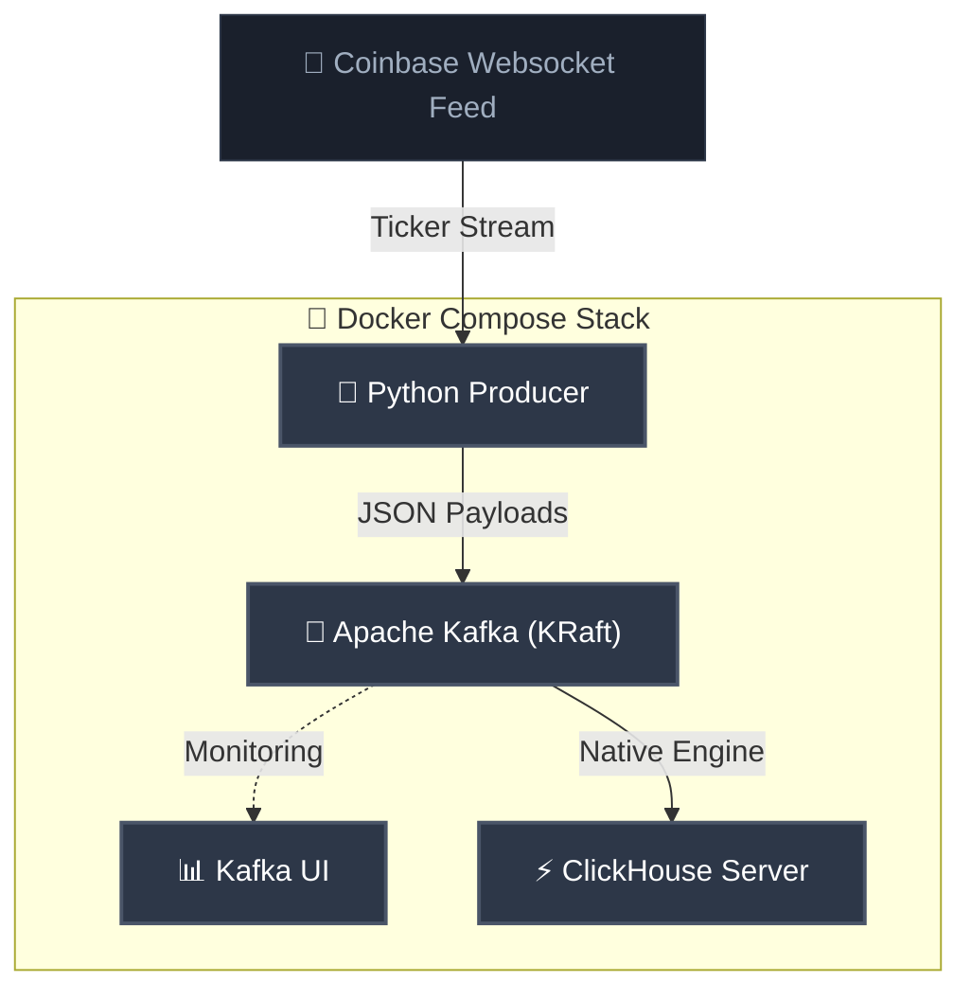

# 🪙 Real-Time Crypto Streaming Pipeline

A production-grade, real-time data streaming pipeline. This architecture ingests high-frequency trade events from Coinbase, buffers them via Apache Kafka, and streams them directly into a ClickHouse OLAP database for sub-second analytical querying and real-time visualization.

---

## 🏗️ System Architecture



---

## ⚡ Core Features

- **Shock-Absorbing Buffer**: Uses Apache Kafka in modern **KRaft mode** to buffer bursty Coinbase trade events without data loss.
- **Zero-Connector Ingestion**: ClickHouse pulls directly from Kafka using its **Native Kafka Engine** and a **Materialized View**, eliminating heavy middleware.
- **Optimized DB Design**: Uses a highly optimized ClickHouse `MergeTree` partitioned daily by trade time and ordered by token symbol.
- **Resilient Producer**: Python ingestion engine featuring thread-safe queue buffering, network compression (LZ4), and progressive startup backoffs.
- **Fully Containerized**: The entire data platform boots reliably with a single Docker Compose command.

---

## 🛠️ Technology Stack

| Component | Technology | Description |
| :--- | :--- | :--- |
| **Data Source** | [Coinbase WebSocket](https://docs.cloud.coinbase.com/exchange/docs/websocket-overview) | Real-time public trade ticker feed |
| **Ingestion Engine** | [Python 3.11+](https://www.python.org/) | Thread-buffered client publishing to Kafka |
| **Message Broker** | [Apache Kafka (KRaft)](https://kafka.apache.org/) | Scalable append-only event queueing |
| **Observability** | [Kafka UI](https://github.com/provectuslabs/kafka-ui) | Web UI for broker monitoring and topic inspection |
| **OLAP Database** | [ClickHouse](https://clickhouse.com/) | Columnar database for high-throughput, low-latency analytics |
| **Orchestration** | [Docker Compose](https://www.docker.com/) | Multi-container lifecycle orchestration |

---

## 🚀 Quick Start Guide

### Prerequisites
- [Docker Desktop](https://www.docker.com/products/docker-desktop/) (running)
- Python 3.11+ (optional, for local development)
- `curl` (for testing)

### 1. Boot the Stack
Spin up the containerized pipeline from the root directory:
```bash
docker compose up -d --build
```
This initializes Kafka (KRaft), Kafka UI (port `8080`), ClickHouse (port `8123` & `9000`), and the Python producer.

### 2. Verify Data Ingestion
Check the live Coinbase stream ingestion logs:
```bash
docker compose logs -f crypto-producer
```
You should see active trade ticker events:
```text
crypto-producer  | 📡 Coinbase Ingest -> BTC-USD | Price: $73368.0000 | Vol: 0.021497
crypto-producer  | 📡 Coinbase Ingest -> ETH-USD | Price: $2013.5900 | Vol: 0.023499
```

### 3. Access Dashboards & Web UI
* **Kafka UI**: Browse topic partitions and messages at `http://localhost:8080`.
* **ClickHouse Playground**: Write queries in the browser console at `http://localhost:8123/play` (User: `default`, Password: `password123`).

---

## 🔍 Database Verification

Verify data flowing into ClickHouse with the following commands:

```bash
# Query the raw ingested trades (last 10 rows)
docker compose exec clickhouse clickhouse-client -u default --password password123 --query \
"SELECT * FROM crypto_trades_raw LIMIT 10"

# View real-time aggregation metrics
docker compose exec clickhouse clickhouse-client -u default --password password123 --query \
"SELECT symbol, count(), round(avg(price), 2) AS avg_price FROM crypto_trades_raw GROUP BY symbol"

# Sub-second windowed analytics query
docker compose exec clickhouse clickhouse-client -u default --password password123 --query \
"SELECT symbol, toStartOfSecond(trade_time) AS sec, avg(price), sum(volume) FROM default.crypto_trades_raw GROUP BY symbol, sec ORDER BY sec DESC LIMIT 10"
```

---

## 🔬 Architectural Highlights

### 1. In-Memory Queue Buffer
The Python producer isolates the network thread from the Kafka producer to prevent packet drops due to backpressure:
- **WebSocket Thread**: Ingests high-frequency JSON frames and pushes to a thread-safe `queue.Queue`.
- **Worker Daemon**: Dequeues records and writes them to Kafka with **LZ4 compression** (saving up to 70% payload size).
- **Startup Sync**: A 10-attempt exponential backoff guarantees clean Kafka connectivity on cold boots.

### 2. ZooKeeper-less Apache Kafka (KRaft)
Consensus is managed internally using KRaft, yielding sub-second controller election times, a streamlined footprint, and zero extra container overhead.

### 3. Three-Tier ClickHouse Ingestion Plan
To eliminate heavy middleware, ClickHouse directly pulls from Kafka using three integrated layers:
1. **Kafka Engine Table (`kafka_crypto_trades`)**: A virtual queue consumer subscribing to the broker. *Do not query directly; reading from it commits offsets and can cause permanent data loss.*
2. **Materialized View (`mv_crypto_trades_raw`)**: An active, event-driven background trigger that automatically maps and pumps consumed records into physical storage.
3. **Persistent Table (`crypto_trades_raw`)**: A highly optimized columnar `MergeTree` table serving as the source-of-truth. **All analytics and downstream applications query this table.**

---

## 🛣️ Roadmap
- [ ] **Real-Time Streamlit Dashboard**: Integrate a frontend to visualize live analytics directly from ClickHouse.
- [X] **AI Assistant**: Introduce a Text-to-SQL chatbot leveraging Gemini to query streaming tables using natural language.