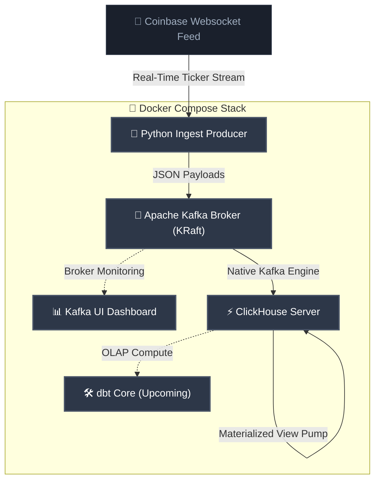

# 🪙 Real-Time Crypto Streaming Pipeline

A lightweight, free, and completely open-source real-time data streaming pipeline. This architecture ingests high-frequency live trade events from Coinbase, buffers them via Apache Kafka, and streams them directly into ClickHouse OLAP database for sub-second analytical querying.

```
                  ┌──────────────────┐
                  │   Coinbase WSS   │
                  └────────┬─────────┘
                           │ (WSS Stream)
                           ▼
                  ┌──────────────────┐
                  │ Python Producer  │
                  └────────┬─────────┘
                           │ (JSON Bytes)
                           ▼
                  ┌──────────────────┐
                  │   Apache Kafka   │◀──────┐
                  └────────┬─────────┘       │ (Monitor)
                           │                 │
            (Native Engine)│                 │
                           ▼                 │
                  ┌──────────────────┐  ┌────┴─────┐
                  │    ClickHouse    │  │ Kafka UI │
                  └────────┬─────────┘  └──────────┘
                           │ (Auto-Pump)
                           ▼
                  ┌──────────────────┐
                  │   MergeTree DB   │
                  └────────┬─────────┘
                           │ (Upcoming)
                           ▼
                  ┌──────────────────┐
                  │     dbt Core     │
                  └──────────────────┘
```

---

## 🏗️ System Architecture



---

## ⚡ Core Features

- **Decoupled Shock Absorption**: Utilizes Apache Kafka in modern ZooKeeper-less **KRaft Mode** to buffer bursty real-time trade events without data loss.
- **Zero-Middleman Ingestion**: ClickHouse pulls directly from Kafka using its **Native Kafka Engine** coupled with an automated **Materialized View Pump**, completely eliminating the need for bulky middleman connectors (like Kafka Connect or Snowflake).
- **Instant Observability**: Fully integrated **Kafka UI** to visually audit topics, offsets, schema structures, and ingestion throughput.
- **Production-Ready Portability**: The entire stack is completely containerized and launches reliably with a single-line command.

---

## 🛠️ Technology Stack

| Component | Tool | Description | Status |
| :--- | :--- | :--- | :--- |
| **Data Source** | [Coinbase Exchange Websocket](https://docs.cloud.coinbase.com/exchange/docs/websocket-overview) | Real-time public trade ticker feed | ✅ Active |
| **Ingestion Producer** | [Python 3.11 / 3.12](https://www.python.org/) | Lightweight, persistent client mapping stream payloads | ✅ Active |
| **Message Broker** | [Apache Kafka (KRaft)](https://kafka.apache.org/) | Append-only event store acting as ingest shock-absorber | ✅ Active |
| **Observability UI** | [Kafka UI](https://github.com/provectuslabs/kafka-ui) | Real-time visual dashboard for topic inspection | ✅ Active |
| **OLAP Database** | [ClickHouse](https://clickhouse.com/) | Ultra-fast column-oriented database for real-time analytics | ✅ Active |
| **Transformation** | [dbt Core](https://www.getdbt.com/) | Modern SQL-based ELT modeling and data transformations | ✅ Active |
| **Orchestration** | [Docker / Compose](https://www.docker.com/) | Complete multi-container lifecycle orchestration | ✅ Active |

---

## 🚀 Quick Start Guide

### Prerequisites
- [Docker Desktop](https://www.docker.com/products/docker-desktop/) (ensure the Docker daemon is active)
- **Python 3.11 or 3.12** (Important: Python 3.13 and 3.14 are not supported yet due to `dbt-core` and internal library compilation limitations)
- `curl` (for testing/inspection)

### 1. Spin Up the Pipeline
Run the following command in the root folder to boot the containerized network:
```bash
docker compose up -d --build
```
This automatically:
1. Provisions the isolated `kafka-net` network.
2. Initializes the single-node **Kafka Broker** in KRaft mode.
3. Fires up the **Kafka UI** on port `8080`.
4. Boots the **Python Ingest Producer** which binds to Coinbase and begins publishing to the `raw_crypto_trades` topic.
5. Launches the **ClickHouse OLAP Database** and boots its initial schema layout.

### 2. Monitor Live Stream Ingestion
Check the live output of your Coinbase producer:
```bash
docker compose logs -f crypto-producer
```
You should immediately see logs showing ingested events:
```text
crypto-producer  | 📡 Coinbase Ingest -> BTC-USD | Price: $73368.0000 | Vol: 0.021497
crypto-producer  | 📡 Coinbase Ingest -> ETH-USD | Price: $2013.5900 | Vol: 0.023499
crypto-producer  | 📡 Coinbase Ingest -> SOL-USD | Price: $82.0600 | Vol: 0.588498
```

---

## 🔍 Verification & Observability

### 1. View Topics via Kafka UI
Open your browser and navigate to:
```
http://localhost:8080
```
Here you can browse the `raw_crypto_trades` topic, audit broker health, track offset logs, and monitor partition details dynamically.

### 2. Audit Ingested Data in ClickHouse
Verify that ClickHouse is successfully consuming, unpacking, and writing data to your persistent table:
```bash
docker compose exec clickhouse clickhouse-client --query "SELECT * FROM crypto_trades_raw LIMIT 10"
```

To see real-time database ingestion stats (such as trade counts per asset):
```bash
docker compose exec clickhouse clickhouse-client --query "SELECT symbol, count(), round(avg(price), 2) AS avg_price FROM crypto_trades_raw GROUP BY symbol"
```

### 3. ClickHouse Play Web Console
For an interactive database console, ClickHouse exposes a visual web-based playground interface. Open your browser and navigate to:
```
http://localhost:8123/play
```
Use the following credentials to authenticate:
- **User**: `default`
- **Password**: `password123`

You can write and run SQL queries directly inside this interactive playground interface.

### 4. Query dbt Analytical Models
Once your dbt models have successfully compiled and materialized, you can query your summary metrics directly:

**Query minute-level aggregated price trends:**
```bash
docker compose exec clickhouse clickhouse-client --query "SELECT * FROM default.minutes_pricing LIMIT 10"
```

**Query second-level high-frequency price actions:**
```bash
docker compose exec clickhouse clickhouse-client --query "SELECT * FROM default.seconds_pricing LIMIT 10"
```

---

## 🔬 Architectural Deep Dive

### 1. The Coinbase Websocket Feed
Instead of polling REST APIs (which degrades performance and hits rate limits), we open a persistent, bi-directional TCP pipe to the official Coinbase Public Exchange Feed (`wss://ws-feed.exchange.coinbase.com`). We subscribe to `ticker` updates for key assets (e.g., `BTC-USD`, `ETH-USD`, `SOL-USD`).

### 2. The Python Ingestion Producer (Thread-Buffered & Robust)
An optimized, thread-buffered Python class. Upon establishing the socket connection, it handles the Coinbase subscription handshake and processes JSON frames on the fly. 

To guarantee production-grade stability:
* **Thread-Safe Queue Buffering**: Raw trade payloads are immediately pushed to an in-memory `queue.Queue` by the WebSocket thread, while a background worker daemon pulls and writes them to Kafka. This completely isolates the WebSocket connection from Kafka network backpressure, avoiding dropped frames.
* **Network Compression**: Incorporates **LZ4 compression** on the Kafka producer, reducing payload size by up to 70%.
* **Exponential Startup Backoff**: Incorporates a 10-attempt progressive retry mechanism to robustly sync container startup order.
* **Logging & Best Practices**: Features fully structured Python `logging` with precise timestamps and object-oriented encapsulation.

### 3. The Message Broker: Apache Kafka (KRaft Mode)
Traditional Kafka architectures require Zookeeper, introducing significant configuration and hardware overhead. We utilize **KRaft Mode** (Kafka Raft metadata mode) which handles consensus directly inside Kafka itself. This yields sub-second controller election times, a streamlined deployment structure, and a minimal footprint.

### 4. The Analytics Database: ClickHouse (Partitioned & Explicit)
To enable low-cost, open-source execution, we migrated the database tier from a heavy Snowflake/Kafka Connect stack to **ClickHouse**. 

The ingestion workflow uses three optimized layers (defined in [clickhouse-init/init.sql](file:///Users/sysung98/Documents/Projects/crypto-streaming-pipeline/clickhouse-init/init.sql)):
1. **The Kafka Engine Queue (`kafka_crypto_trades`)**: Actively subscribes to the Kafka Broker and consumes byte packets from the `raw_crypto_trades` topic in `JSONEachRow` format.
2. **The Persistent Table (`crypto_trades_raw`)**: A highly optimized `MergeTree` table that serves as the permanent data vault. It aggregates incoming records on disk, organizes them by `(symbol, trade_time)`, and partitions them daily using `PARTITION BY toYYYYMMDD(trade_time)` to prune directories during historical queries.
3. **The Materialized View Pump (`mv_crypto_trades_raw`)**: An active background daemon that binds the Kafka Engine Queue directly to the Persistent Table. It explicitly maps columns (`symbol`, `price`, `volume`, `timestamp`) to protect against columns misalignment and silent schema drifts.

### 5. The Transformation Layer: dbt Core (Incremental Processing)
Instead of executing full table refreshes (which completely drops and recreates tables, causing query downtime and massive ClickHouse write cycles), our analytical transformations process data **incrementally**.

Using the `dbt-clickhouse` adapter, the models (`minutes_pricing` and `seconds_pricing`) dynamically inspect their target materializations to find the maximum existing timestamp and only read fresh trade ticks that have arrived since that execution:
```sql

    WHERE trade_time > (SELECT max(analytical_minute) FROM {{ this }})

```
This reduces execution runtime to under **0.5 seconds**, massively reducing database memory and storage overhead in high-throughput production environments.

---

## 🛣️ Roadmap & Next Steps

- [ ] **Real-Time Dashboards**: Build a lightweight dashboard (using Streamlit or Grafana) to visualize high-frequency live crypto price actions directly from ClickHouse.