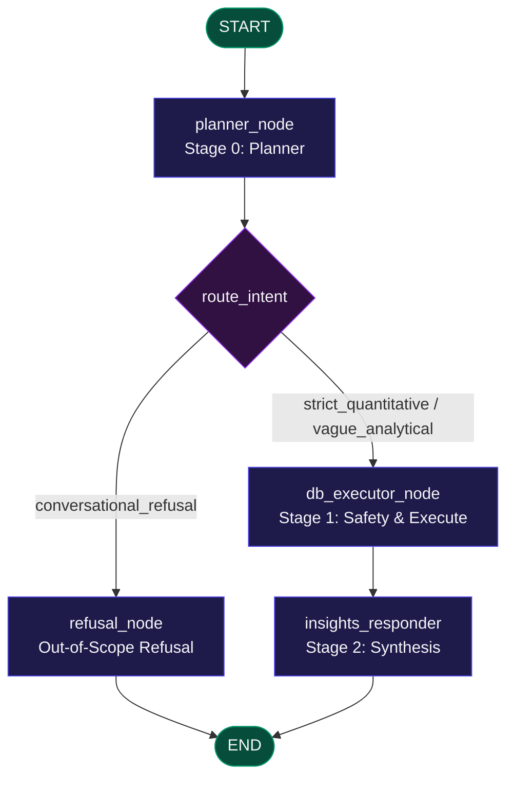

# 🪙 Real-Time Crypto Streaming Pipeline

A production-grade, real-time data streaming pipeline. This architecture ingests high-frequency trade events from Coinbase, buffers them via Apache Kafka, and streams them directly into a ClickHouse OLAP database for sub-second analytical querying and real-time visualization. It features a stateful, multi-stage LangGraph AI Agent to query your real-time database via natural language.

---

## 🚀 Part 1: Getting Started Quickly (Playground Guide)

This section is designed to get you up, running, and playing with the data and AI agent as fast as possible.

### 📋 Prerequisites

Before launching the stack, ensure you have:
1. **Docker Desktop** installed and running.
2. **Python 3.11+** (optional, for local client testing).
3. **API Keys & Configuration** in a `.env` file in the project root:
   - **Coinbase API Keys**: **Not Required**. The ingestion pipeline streams from public WebSocket feeds.
   - **AI_PROVIDER**: Determines which LLM service the agent uses (`gemini` or `hf`). Defaults to `gemini` if not specified.
   - **GEMINI_API_KEY**: Required for the default `gemini` AI agent (obtain a free key from [Google AI Studio](https://aistudio.google.com/)).
   - **HF_TOKEN**: Required if you switch `AI_PROVIDER=hf` to run serverless inference on Hugging Face (obtain from [Hugging Face Settings](https://huggingface.co/settings/tokens)).

Create a `.env` file in the root of the project:
```env
# Selected LLM provider: 'gemini' or 'hf'
AI_PROVIDER=gemini

# LLM API credentials
GEMINI_API_KEY=your_gemini_api_key_here
HF_TOKEN=your_huggingface_access_token_here

# Optional: Customize host ports to avoid local conflicts (default values shown)
# KAFKA_PORT=9092
# KAFKA_UI_PORT=8080
# CLICKHOUSE_HTTP_PORT=8123
# CLICKHOUSE_NATIVE_PORT=9000
# CHAT_BACKEND_PORT=8000
```

### 1. Boot the Stack
Build and spin up the containerized pipeline from the root directory:
```bash
# Clean reset of existing volumes (highly recommended)
docker compose down -v

# Boot the stack in detached mode
docker compose up -d --build
```
This initializes Kafka (KRaft), Kafka UI, ClickHouse, the Python Coinbase websocket producer, and the FastAPI Chat Agent.

### 2. Access Dashboards & Web UIs
Once the containers boot, you can access the following services locally (or using the custom ports defined in your `.env`):

*   **📊 Kafka UI**: [http://localhost:8080](http://localhost:8080)
    *   Browse live message partitions, cluster health, and verify raw events streaming into `raw_crypto_ticker` and `raw_crypto_l2` topics.
*   **⚡ ClickHouse Playground**: [http://localhost:8123/play](http://localhost:8123/play)
    *   An interactive browser-based SQL console.
    *   **User:** `default`
    *   **Password:** `password123`
*   **🤖 FastAPI Agent Service**: [http://localhost:8000/api/health](http://localhost:8000/api/health)
    *   Verify the AI Agent's database connectivity and model initialization status.


---

## 📊 Product 1: The ClickHouse Database Playground
The Coinbase WebSocket producer streams raw trade data and L2 order books continuously. You can verify and interact with this live stream by executing queries in the **ClickHouse Playground**:

### 💡 Example SQL Queries to Try:

#### 1. Real-Time Price Tickers (Last 10 Rows)
```sql
SELECT symbol, price, volume_24h, best_bid, best_ask, server_time 
FROM crypto_ticks_raw 
ORDER BY server_time DESC
LIMIT 10;
```

#### 2. Streaming Volumetrics & Average Prices
```sql
SELECT symbol, count() AS tick_count, round(avg(price), 2) AS avg_price 
FROM crypto_ticks_raw 
GROUP BY symbol;
```

#### 3. Flattened L2 Order Book Depth Updates (Last 10 Rows)
```sql
SELECT symbol, side, price, volume, trade_time 
FROM crypto_l2_raw 
ORDER BY trade_time DESC
LIMIT 10;
```

#### 4. Live Best Bid-Ask Spreads (Computed from L2 Data)
```sql
SELECT 
    symbol, 
    max(price) FILTER(WHERE side = 'bid') AS best_bid, 
    min(price) FILTER(WHERE side = 'offer') AS best_ask, 
    round(best_ask - best_bid, 4) AS spread 
FROM crypto_l2_raw 
GROUP BY symbol;
```

---

## 🤖 Product 2: Conversational AI Analytics Agent
The backend hosts an interactive **3-Stage Conversational Agentic Planner & SQL Router** powered by **LangGraph**. It translates natural language questions into safe ClickHouse SQL queries, runs them, and returns formatted responses.

### 💡 Sample Prompts to Try
Test the agent using the prompt categories below:

| Category | Sample Prompt | Under the Hood (Agent Action) |
| :--- | :--- | :--- |
| **Out-of-Scope Refusal** | `"What is the capital city of France?"` | Bypasses ClickHouse database; agent politely declines to answer non-crypto questions. |
| **Speculative Query** | `"Which coin will make me a millionaire the fastest? Explain your reasoning."` | Translates a vague question into a safe analytical plan on momentum/volatility, and returns findings prepended with a **bold financial disclaimer**. |
| **Spread Analysis** | `"Show me the latest best bid, best ask, and spread for SOL-USD computed from the L2 updates."` | Executes standard SQL filtering `crypto_l2_raw` by bid/offer sides and calculates the spread. |
| **Market Volumetrics** | `"Did the volume for ETH-USD spike over the last hour, or is the market quiet?"` | Queries rolling volume aggregates in ClickHouse to determine volume change ratios. |

### 🧪 Fast Testing via CLI
You can test the agent's response directly from your terminal:
```bash
curl -X POST http://localhost:8000/api/chat \
  -H "Content-Type: application/json" \
  -d '{"question": "Give me the average price of BTC-USD in our database"}'
```

To run the full backend testing suite:
```bash
# Install local requirements
pip install -r backend/requirements.txt

# Run automated tests
python backend/tests/test_api.py
```

---

## 🏗️ Part 2: Technical Implementation & Architecture

### System Architecture
The following flowchart illustrates the high-throughput ingestion flow and the agentic query path:


### Ingestion Details & Resiliency
1.  **Multi-Stream Producer**:
    *   An OOD base class wrapper (`BaseCoinbaseProducer`) powers decoupled threads for the `ticker` and `level2` websocket channels.
    *   **In-Memory Buffering**: Websocket threads push JSON payloads to a thread-safe `queue.Queue`. A worker thread pulls tasks asynchronously to isolate network ingestion from Kafka broker latency.
    *   **Compression**: Network payload size is compressed up to 70% using native **LZ4 compression**.
    *   **Startup Sync**: Uses a 10-attempt exponential backoff supervisor to verify broker connection before ingesting.
2.  **Apache Kafka (KRaft)**:
    *   Operates without ZooKeeper. Tickers and L2 orders are segregated into separate topics (`raw_crypto_ticker`, `raw_crypto_l2`) to avoid consumer-side head-of-line blocking.
3.  **ClickHouse Native Ingestion**:
    *   ClickHouse connects directly to Kafka using native ingestion engines, avoiding middleware:
        *   **Kafka Engine Tables** (`kafka_crypto_ticks`, `kafka_crypto_l2`): Consume from designated topics.
        *   **Materialized Views** (`mv_crypto_ticks_raw`, `mv_crypto_l2_raw`): Parse raw JSON payloads and cast timestamps to high-precision `DateTime64` structures in the background.
        *   **MergeTree Columnar Tables** (`crypto_ticks_raw`, `crypto_l2_raw`): Fast, on-disk columnar structures sorted by primary keys.

---

### Conversational Agent Cognitive Architecture
The agent uses a structured **3-stage LangGraph cognitive pipeline** rather than a single text-to-SQL script:



1.  **Stage 0: Intent Classifier & Planner**: Evaluates user prompts with Chain-of-Thought (CoT) reasoning. Decides whether requests are out-of-scope (`conversational_refusal`), direct queries (`strict_quantitative`), or require interpretation (`vague_analytical`).
2.  **Stage 1: Safety Guard & Database Executor**: If valid, strips comments and blocks forbidden keywords (`DROP`, `ALTER`, `TRUNCATE`) using a read-only guard (`is_query_safe(sql)`). Executed queries are run against ClickHouse with `MAX_ROWS` constraints.
3.  **Stage 2: Insights Synthesizer**: Formulates grounded markdown responses from data rows. Speculative queries are prepended with an explicit, bold financial disclaimer.
4.  **Stateful Memory**: conversational history is persisted across turns using LangGraph's native `MemorySaver` checkpointer.

---

## 💡 Developer Tips

*   **Avoiding Gemini Rate Limits (`AI_PROVIDER=hf`)**: 
    The free Gemini tier has a **15 RPM (Requests Per Minute)** limit. If you hit this limit during development or testing, configure `AI_PROVIDER=hf` and supply your `HF_TOKEN` in `.env` to run agent serverless queries via Hugging Face.
*   **Wiping Data vs. Ingestion Pipeline Restarts**:
    Running `docker compose down -v` cleanly deletes all volume contents including Kafka offset markers and stored ClickHouse tables. If you only want to restart the ingestion stream (e.g., to reconnect to the WebSocket after network changes) without losing analytical data, run:
    ```bash
    docker compose restart crypto-producer
    ```
*   **Handling Local Port Conflicts**:
    You can customize the exposed host ports for any service by defining variables such as `KAFKA_UI_PORT` or `CHAT_BACKEND_PORT` inside your local `.env` file before booting the stack.